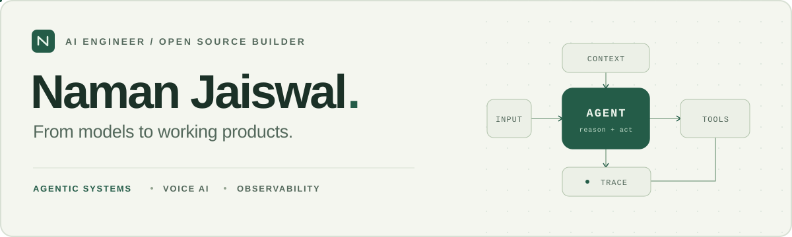

<picture>
  <source media="(prefers-color-scheme: dark)" srcset="./assets/profile-dark.svg">
  <source media="(prefers-color-scheme: light)" srcset="./assets/profile-light.svg">
  
</picture>

  <a href="https://namanjaiswal.in"><b>Portfolio</b></a>
  &nbsp; / &nbsp;
  <a href="https://www.linkedin.com/in/namanjaiswalofficial"><b>LinkedIn</b></a>
  &nbsp; / &nbsp;
  <a href="mailto:namanjaiswalofficial@gmail.com"><b>Email</b></a>
  &nbsp; / &nbsp;
  <a href="https://x.com/Namanjaiswal21"><b>X</b></a>

I build **AI agents, real-time voice systems, and the infrastructure to understand how they behave** — from retrieval and model training to APIs, interfaces, and cloud deployment.

**AI Research Intern at C3aLabs** · **B.Tech, NIT Rourkela ’28** · **President, AI Club**

## Selected work

<table>
<tr>
<td>
<h3><a href="https://github.com/jaiswal-naman/agentland">01 / Agentland</a></h3>

<b>See what your AI agents are doing.</b> A Rust proxy for request capture, cost attribution, PII detection, and policy enforcement.

<code>Rust</code> <code>React</code> <code>TimescaleDB</code> &nbsp; <a href="https://github.com/jaiswal-naman/agentland/stargazers">50+ stars</a> · <a href="https://github.com/jaiswal-naman/agentland/tree/main/crates">Architecture →</a>

</td>
</tr>
<tr>
<td>
<h3><a href="https://github.com/jaiswal-naman/ShodhAI">02 / ShodhAI</a></h3>

<b>From a research question to a cited report.</b> Parallel analyst agents, live web research, and human feedback in a resumable workflow, with DOCX and PDF export.

<code>Python</code> <code>LangGraph</code> <code>FastAPI</code> &nbsp; <a href="https://github.com/jaiswal-naman/ShodhAI#readme">Research pipeline →</a>

</td>
</tr>
<tr>
<td>
<h3><a href="https://github.com/jaiswal-naman/rag-voice-ai-agent">03 / RAG Voice AI</a></h3>

<b>Talk to your equipment documentation.</b> A voice assistant connecting streaming audio, document retrieval, LLM tool calls, and spoken responses.

<code>React</code> <code>FastAPI</code> <code>Pipecat</code> <code>AWS</code> &nbsp; <a href="https://github.com/jaiswal-naman/rag-voice-ai-agent#readme">Voice pipeline →</a>

</td>
</tr>
<tr>
<td>
<h3><a href="https://github.com/jaiswal-naman/voicemon">04 / VoiceMon</a></h3>

<b>Understand every layer of a voice agent.</b> Instrumentation for network quality, speech and LLM latency, user experience, and session outcomes.

<code>OpenTelemetry</code> <code>Prometheus</code> <code>Grafana</code> &nbsp; <a href="https://github.com/jaiswal-naman/voicemon#readme">Observability stack →</a>

</td>
</tr>
</table>

**Working from the fundamentals, too.**

- **[DistriNews](https://github.com/jaiswal-naman/distrinews)** — DistilBERT news classification with PyTorch Distributed Data Parallel, multi-GPU training, checkpointing, and a containerized inference API.
- **[GPT from scratch](https://github.com/jaiswal-naman/built-llm-from-scratch-and-fine-tuned-it-as-personal-assistant-and-spam-detector)** — Implemented a GPT-style language model and fine-tuned it for spam classification and instruction following.

## Where I’ve built

**C3aLabs · AI Research Intern** &nbsp; Jun 2026–present 
Agent workflows, small language models, model routing, and research-to-MVP development.

**AmericSoft Solutions · AI Engineer Intern** &nbsp; Mar–Jun 2026 
Enterprise RAG and agent components, tool calling, observability, and evaluation.

**ThinkingStone · AI Developer Intern** &nbsp; Jun–Aug 2025 
Voice agents, dialogue management, and real-time WebRTC infrastructure.

## Tools behind the work

**Build** &nbsp; Python · Rust · TypeScript · SQL · FastAPI · React 
**Intelligence** &nbsp; PyTorch · LangGraph · RAG · MCP · Pipecat · LiveKit 
**Operate** &nbsp; PostgreSQL · MongoDB · Redis · Docker · AWS · Azure · OpenTelemetry

<b>Beyond the code</b>

- **President, AI Club, NIT Rourkela** — Technical workshops, project mentorship, and applied LLM and agent sessions.
- **HackNITR organizing team** · **GDSC NIT Rourkela core member**.
- Selected cohort participant, **Y Combinator Startup School India 2025**.
- **NTSE Scholar (2021)** · **State Child Scientist (2019)**.
- B.Tech at **NIT Rourkela**, 2024–2028.

## The commit trail

<picture>
  <source media="(prefers-color-scheme: dark)" srcset="https://raw.githubusercontent.com/jaiswal-naman/jaiswal-naman/output/github-contribution-grid-snake-dark.svg">
  <source media="(prefers-color-scheme: light)" srcset="https://raw.githubusercontent.com/jaiswal-naman/jaiswal-naman/output/github-contribution-grid-snake.svg">
  
</picture>

---

**Have an interesting AI problem?** I’m open to AI engineering internships, open-source work, and collaborations. 
[Let’s talk →](mailto:namanjaiswalofficial@gmail.com) &nbsp; [More about my work →](https://namanjaiswal.in)
